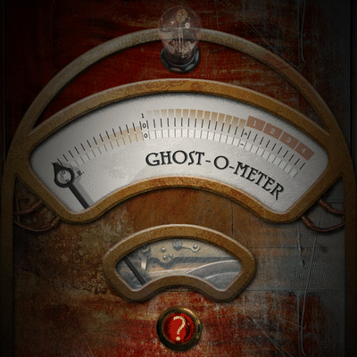

# Ghost-O-Meter

  

  <strong>▶ Play it now: <a href="https://adrian3.github.io/ghost-o-meter/">adrian3.github.io/ghost-o-meter</a></strong> 
  Open it on your phone, tap the gauge, and start hunting. Add it to your home screen to install it as an app.

**Ghost-O-Meter** was an iPhone and iPad app that came out in the fall of
2011: a vintage brass-and-leather ghost detector with a swinging P.K.E.
needle, a bulb that glows brighter the closer you get, and a mechanical
counter that ticks up every time you find one. It went viral. It reached
**#1 in the Entertainment category in six countries and the top 10 overall
in five**, sold for 99¢, spiked every Halloween for years, and won a 2012
Art Directors Club of Denver award.

This repository is an archive of that app, rebuilt as a **progressive web
app** so it can keep running long after the App Store build stopped
working on new phones. The goal is fidelity, not modernization: the same
artwork, the same sounds, the same detection maths and timings, the same
five screens. Only the plumbing changed, from Apache Cordova to plain HTML,
CSS and JavaScript that any modern mobile browser can run and install to the
home screen.

## The legacy

Ghost-O-Meter was conceived, designed and developed by
[Adrian Hanft](http://adrian3.com) and produced at Burns Marketing
Communications in 2011–2012, where it served a second purpose: a public proof that an agency known for logos,
websites and brochures could build a mobile app people wanted to share.
It worked. Client app projects followed, and the app itself took on a life
of its own.

People took it seriously. Users posted earnest "cemetery field test" videos
to YouTube. Reviews read like this:

> It really works. I went in my room, turned off the lights, and the spike
> went up — I found 11 ghosts in 1 minute.

> Me and my dad put two fingers on each side of our iPad. I told it, "if
> anyone is out there, move the pillow." We sat there for five minutes.
> Then it suddenly moved!

> My wife and I took the ghost tour at the Stanley (the most haunted place
> in America) and afterwards took our own tour using Ghost-O-Meter. This app
> was 100% "dead on" outside rooms 217, 401 and 428.
> — Philip Hastings, December 18, 2011

In 2015 the app was updated to remove the Google Analytics tracking it had
shipped with; the story of that decision is in
[*I released Ghost-O-Meter with a secret. I realize now that it was a mistake.*](https://ade3.medium.com/a-confession-from-ghost-o-meter-s-creator-594b50fe4fa7)
This archive carries no analytics of any kind.

The full story of the app, with the ranking chart, the award and the field
test video, is in the case study at
[adrian3.com/design/case-studies/Ghost-O-Meter.html](https://adrian3.com/design/case-studies/Ghost-O-Meter.html).

## The original App Store description

Preserved here as it appeared on the iTunes App Store:

> The stories of encounters with the Ghost-O-Meter continue to spread. One
> look at the reviews will tell you there is definitely something special
> about this app.
>
> Nobody took it seriously at first. Unexplained noises. The occasional
> sound of soft voices. Was that the wind? Sometimes our monitors would
> flicker. Certain places in the office were noticeably colder than others.
> Nothing to worry about. Or so we thought. Then things got kind of creepy.
> Things started going missing. Cryptic messages appearing on the mirrors in
> the bathroom. Some days the whole building would feel like it was swaying.
> Things would go missing then reappear elsewhere in our building. Finally,
> we had to confront the possibility that maybe, just maybe, the building
> was haunted.
>
> Ghost-O-Meter is a tool created for detecting ghosts. As Ghost-O-Meter
> detects paranormal activity the needle will move and vibrate. If the ghost
> readings are strong enough the light will glow brightly. If you actually
> find a ghost the counter will increase to indicate a successful ghost
> encounter.
>
> Use Ghost-O-Meter to scan your building for paranormal activity. Get a
> creepy feeling at a certain spot in the woods? Test it for ghosts.
> Sometimes even the safest spots could be filled with spirits. You don't
> know until you test it. Download the Ghost-O-Meter today and see if you
> can find any ghosts. This app was created for your entertainment, and
> while we can't guarantee true ghost metering/locating functionality, it
> definitely has an uncanny ability to give unexplained feedback.

## How to play

1. To track down a ghost, slowly move the Ghost-O-Meter around the room.
2. When you notice a spike of the needle, stop and slowly move in the
   direction of the activity.
3. Now that you are locked onto the ghost, raise and lower the
   Ghost-O-Meter until the needle shows high readings.
4. Be quick, because ghosts get frightened quickly. If you don't find the
   ghost in time, it might escape.
5. When you find a ghost, the counter will keep track of your success. How
   many ghosts can you find?

Your lifetime records (ghosts detected, found and escaped) are kept on the
device, just as they were in the original.

## Running it

The app is a static site. Open `index.html` over HTTPS (or `localhost`)
and it runs; there is no build step and nothing to install.

### Hosting on GitHub Pages

The live copy at [adrian3.github.io/ghost-o-meter](https://adrian3.github.io/ghost-o-meter/)
is served straight from this repository: **Settings → Pages → Deploy from a
branch**, `master` branch, `/ (root)` folder. Every push to `master` redeploys
it within a minute or so.

All paths are relative, so it works at a sub-path like the one above or at
the root of a custom domain. The service worker and manifest require HTTPS,
which GitHub Pages provides.

### Installing on a phone

- **iPhone:** open [the link](https://adrian3.github.io/ghost-o-meter/) in
  Safari, tap Share, then *Add to Home Screen*.
- **Android:** open it in Chrome and accept the *Install app* prompt, or use
  the browser menu → *Add to Home screen*.

Once installed it runs offline, full screen, with the original icon.

### Sensors and the first tap

Ghost-O-Meter hunts with the phone's compass (magnetometer) and tilt
sensor, not GPS. iOS Safari only grants access to those from inside a user
gesture, and every mobile browser blocks sound until the page has been
tapped once, so the meter shows a small *Tap to power on* hint until the
first tap. On iPhone that tap brings up the system "motion & orientation"
permission dialog; on Android the sensors start immediately and the tap
just turns the sound on.

On a desktop browser with no motion sensors the meter falls back to the
mouse: left/right is compass direction, up/down is tilt.

## How it is built

| File | Purpose |
| --- | --- |
| `index.html` | The five screens: meter, records, instructions, settings, about |
| `styles/styles.css` | Layout. The app is drawn on the original 320×480 stage, which JS scales to fit any screen |
| `js/ghost.js` | The game: ghost generation, scoring, detection timers, lifetime records in `localStorage` |
| `js/sensors.js` | Compass heading and tilt from the `deviceorientation` API; feeds `ghost.js` |
| `js/app.js` | Needle, lights, counter wheel, panel navigation, settings actions |
| `js/audio.js` | The three sound effects via HTML5 `Audio` |
| `sw.js` | Service worker: precaches everything so the app runs offline |
| `manifest.webmanifest` | PWA manifest (name, icons, standalone display) |
| `images/`, `fonts/`, `audio/` | The original artwork, the Roskell typeface and the sound effects |

### What changed from the Cordova build

| Cordova (2011–2015) | Web (2026) |
| --- | --- |
| `navigator.compass.watchHeading` | `deviceorientation` (`webkitCompassHeading` on iOS, absolute `alpha` on Android) |
| `navigator.accelerometer.watchAcceleration` → pitch | `deviceorientation` `beta`, negated to keep the original 0 = flat, −90 = upright convention |
| `Media` plugin | `new Audio()` |
| `navigator.notification.vibrate` | `navigator.vibrate` (Android only; iOS Safari has no vibration API) |
| `navigator.notification.alert` | inline status text |
| `deviceready` / `pause` / `resume` | page load / `visibilitychange` |
| jQuery + FastClick | plain DOM |
| 20 MB of WAV audio | 1.9 MB of MP3, same recordings |
| Fixed 320×480 layout plus separate iPad CSS | one stage, scaled with `transform` |
| Google Analytics (removed in 2015) | nothing |

Game logic, thresholds and timings are unchanged. A ghost appears every
15 seconds after the last one leaves, lives for 165 seconds if not found,
needs 5 seconds of a strong reading to be caught, and lingers for a minute
once found, exactly as in 2011.

### Updating the app

When you change any file, bump `CACHE_VERSION` in `sw.js` (for example
`ghost-o-meter-v2`). Installed copies pick up the new files on their next
launch; without the bump they keep serving the old cached version.

## Rights

Copyright © 2011–2026 Adrian Hanft. All rights reserved.

This repository is published so the app can be seen and played, not so it
can be reused. The Ghost-O-Meter name, artwork, sounds, text and code are
not licensed for copying, redistribution or derivative works without
written permission.

---

Ghost-O-Meter was created for your entertainment. We still can't guarantee
true ghost metering/locating functionality.
